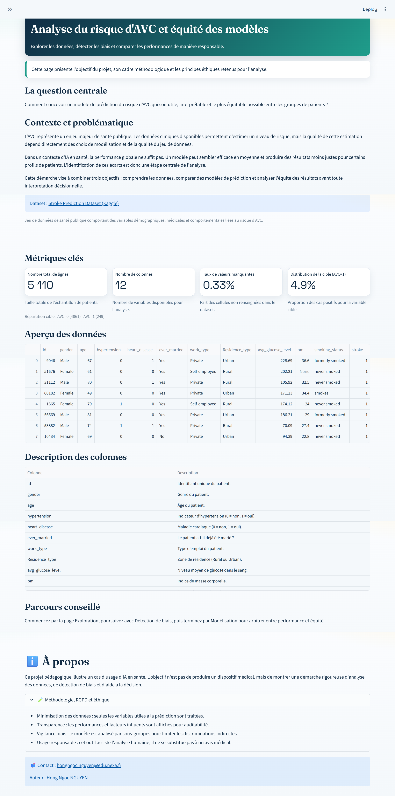
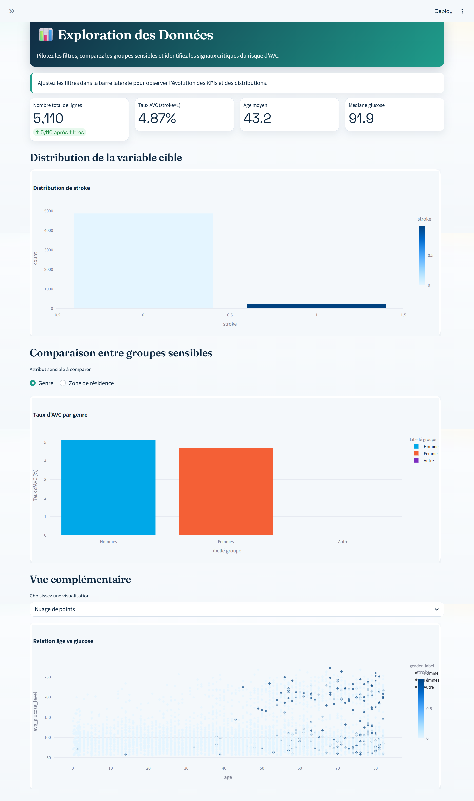
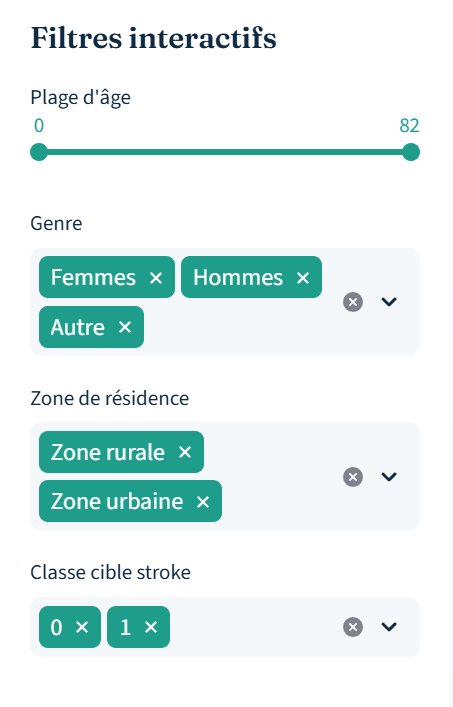
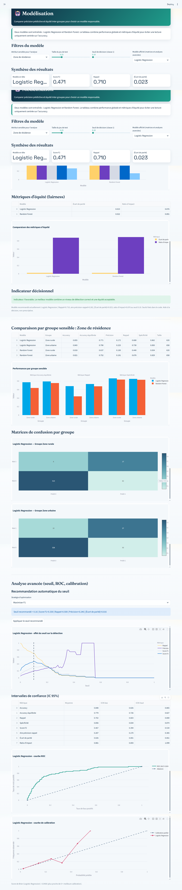
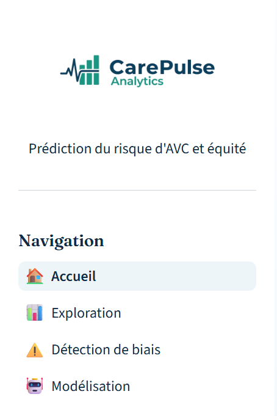

# Analyse du risque d'AVC, biais et modélisation responsable

## Application en ligne
https://detection-de-biais-nguyen.streamlit.app/

## Description
Cette application Streamlit permet d'analyser le jeu de données Stroke Prediction de bout en bout: exploration des données, détection de biais sur attributs sensibles, puis comparaison de modèles de classification en tenant compte de la performance et de l'équité.

## Fonctionnalités
- Page d'accueil avec question centrale, contexte, KPIs, aperçu interactif des données et dictionnaire de colonnes.
- Exploration des données avec filtres interactifs (âge, genre, résidence, classe cible).
- Visualisations clés: distribution cible, comparaison de groupes sensibles, vue complémentaire (scatter/box/heatmap/pie).
- Détection de biais avec métriques fairness, interprétation et recommandations.
- Modélisation comparative (Logistic Regression, Random Forest) avec analyses globales et par groupe.
- Matrices de confusion par groupe, analyse de seuil, ROC et calibration.
- Branding custom: logo dans la sidebar.

## Technologies
- Python 3
- Streamlit
- Pandas
- NumPy
- Plotly
- Scikit-learn

## Installation locale
Prérequis:
- Python 3.10+ recommandé
- pip

Étapes (Windows / PowerShell):
1. Cloner le repository puis se placer dans le dossier du projet.
2. Créer un environnement virtuel:
   python -m venv .venv
3. Activer l'environnement:
   .\.venv\Scripts\Activate.ps1
4. Installer les dépendances:
   pip install -r requirements.txt
5. Lancer l'application:
   streamlit run app.py

## Déploiement
Streamlit Community Cloud
1. Pousser le projet sur GitHub.
2. Se connecter à https://share.streamlit.io/
3. Créer une nouvelle app et sélectionner le repo.
4. Configurer le point d'entrée sur app.py.
5. Déployer.

Lien de l'application déployée:
- https://detection-de-biais-nguyen.streamlit.app/

Notes:
- requirements.txt doit être présent à la racine.
- Le fichier healthcare-dataset-stroke-data.csv doit être versionné dans le repo.

## Usage
Parcours conseillé:
1. Accueil: comprendre le contexte, les indicateurs globaux et le dataset.
2. Exploration: appliquer des filtres et observer les distributions.
3. Détection de biais: analyser DPD/DI selon l'attribut sensible.
4. Modélisation: comparer les modèles, examiner les performances par groupe et les matrices de confusion.

Métriques fairness utilisées:
- Parité démographique (DPD): écart de taux positif entre groupes.
- Impact disproportionné (DI): ratio taux positif groupe non privilégié / groupe privilégié.

## Screenshots

### Accueil

### Exploration des données

### Filtres interactifs

### Détection de biais

### Modélisation

### Sidebar & navigation

## Auteur
- Hong Ngoc NGUYEN
- Contact: hongngoc.nguyen@edu.nexa.fr

## License
Ce projet est distribué sous licence MIT. Voir le fichier LICENSE.
